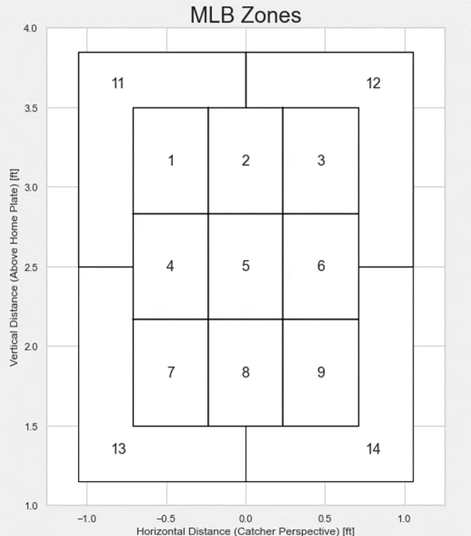

# Optimal Pitch Prediction Model

### A Machine Learning Approach to Baseball

##### Nolan Lo
##### January 26, 2025

In pitching, success is often measured by velocity, accuracy, and spin rate, but the true battle between a pitcher and batter goes far beyond raw metrics. The best pitchers don’t just throw—they outthink their opponents, anticipating what the hitter expects and using deception to stay one step ahead. This mental chess match, often called the game within the game, is what separates good pitchers from great ones.

While traditional scouting and analytics provide valuable insights into pitch selection, machine learning takes it further.

This project builds a machine learning model in Python to predict the optimal pitch type and location to maximize the chances of a swing and miss (WHIFF) or a called strike (no swing). Built using XGBoost, the model leverages key features such as the previous pitch type, its location, and the current game situation to identify the best possible pitch decision.

## Data and Features
The model is trained on Statcast data, which tracks every pitch thrown throughout the entire 2024 season. While the dataset contains a wealth of information, we focus on the following key features:
  - Previous pitch type
  - Previous pitch zone location
  - Current pitch type
  - Current pitch zone location
  - Current count and outs
  - Target variable: A boolean indicating whether the pitch resulted in a WHIFF or a called strike.
After performing feature engineering and data preprocessing, the dataset is ready for model training and evaluation.

* For reference, below are the different zones used by baseball savant and statcast (Catcher's POV).

## Model Training and Evaluation
Using reigning AL Cy Young winner, Tarik Skubal, as an example, we train our model and assess its performance using the following metrics:
  - Log Loss: Measures how well the model predicts probabilities. A lower log loss indicates that the predicted probabilities are well-calibrated and close to the true values.
  - ROC-AUC (Receiver Operating Characteristic - Area Under the Curve): Evaluates the model’s ability to distinguish between WHIFFs and non-WHIFFs. A higher score means better separation between the two classes.
  - Brier Score: Assesses the accuracy of predicted probabilities. A lower score indicates better probability calibration.
  - SHAP Summary Plot: Provides interpretability by showing how each feature influences the model’s predictions, helping us understand which factors contribute most to a successful pitch.

