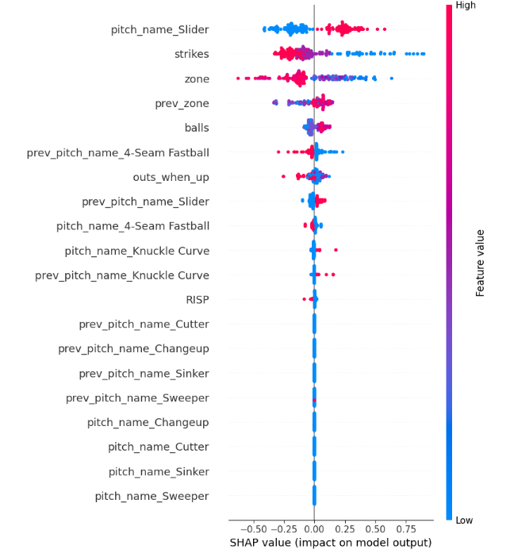

# Optimal Pitch Prediction Model

### A Machine Learning Approach to Baseball

##### Nolan Lo
##### January 26, 2025

## Introduction
Success in pitching is often attributed to velocity, accuracy, and spin rate. However, the true battle between a pitcher and a batter extends beyond raw metrics. The best pitchers don’t just rely on their physical tools—they strategize, outthinking hitters by predicting their expectations and using deception to gain an edge. This psychological chess match, often called the game within the game, is what separates good pitchers from great ones.

While traditional scouting and analytics provide valuable insights into pitch selection, machine learning takes it further.

This project builds a machine learning model in Python to predict the optimal pitch type and location to maximize the chances of a swing and miss (WHIFF) or a called strike (no swing). Built using XGBoost, the model leverages key features such as the previous pitch type, its location, and the current game situation to identify the best possible pitch decision.

## Data and Features
The model is trained on Statcast data, which tracks every pitch thrown throughout the entire 2024 season. While the dataset contains a wealth of information, we focus on the following key features:
  - Previous pitch type
  - Previous pitch zone location
  - Current pitch type
  - Current pitch zone location
  - Current count and outs
  - Target variable: A boolean indicating whether the pitch resulted in a WHIFF or a called strike.
After performing feature engineering and data preprocessing, the dataset is ready for model training and evaluation.

* For reference, below are the different zones used by baseball savant and statcast (Catcher's POV).

## Model Training and Evaluation
To assess the model’s effectiveness, we trained it using Dylan Cease (vs. left-handed hitters) as an example. The model’s performance is evaluated using the following metrics:
  - Log Loss: Measures how well the model predicts probabilities. A lower log loss indicates that the predicted probabilities are well-calibrated and close to the true values.
  - ROC-AUC (Receiver Operating Characteristic - Area Under the Curve): Evaluates the model’s ability to distinguish between WHIFFs and non-WHIFFs. A higher score means better separation between the two classes.
  - Brier Score: Assesses the accuracy of predicted probabilities. A lower score indicates better probability calibration.
  - SHAP Summary Plot: Provides interpretability by showing how each feature influences the model’s predictions, helping us understand which factors contribute most to a successful pitch.

## Model Performance Metrics (Dylan Cease vs. LHB)
Log Loss: 0.4890

ROC-AUC: 0.7831

Brier Score: 0.1579

Below is the SHAP summary plot, which highlights the most influential features in our model’s decision-making process:

Note that different pitchers against different handed batters will produce different metrics. The results of the metrics should determine how much trust is put in the model for a given pitcher, batter combination.

## Model Results: Optimal Pitch Selection
Continuing with the Dylan Cease (vs. left-handed hitters) as an example, we use the model to predict the 10 most optimal pitch types and locations under the following game situation:
  - The previous pitch was a fastball in zone 5
  - The count is 2-2 with 1 out
  - There are runner(s) in scoring position

## Recommended Pitch Selection (Ranked by WHIFF / Called Strike Probability)

## Potential Improvements
While the model performs well, there are several areas where further improvements can be made:
  - Feature Selection: Adding new features (or removing less relevant ones) may enhance the model’s predictive accuracy.
      - Example: Including previous pitch result (e.g., was the previous pitch a WHIFF, foul ball, or ball in play?) could improve decision-making.
  - Incorporating Batter Data: Understanding batter tendencies, such as chase rates and swing decisions, could improve pitch recommendations.

